# Zadanie 1

## 1.

Screen:
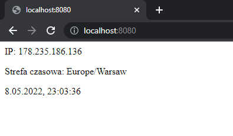


##  2.

dockerfile
```sh
# syntax=docker/dockerfile:1

# Autor Krzysztof Zarębski

FROM node:latest

WORKDIR /app
COPY index.js package.json package-lock.json ./
RUN npm install --production

ENTRYPOINT [ "node" ]
CMD [ "index.js" ]

```

##  3.
a. Budowa obrazu:

```sh
docker build -t technologie_chmurowe_zadanie_1 .
```
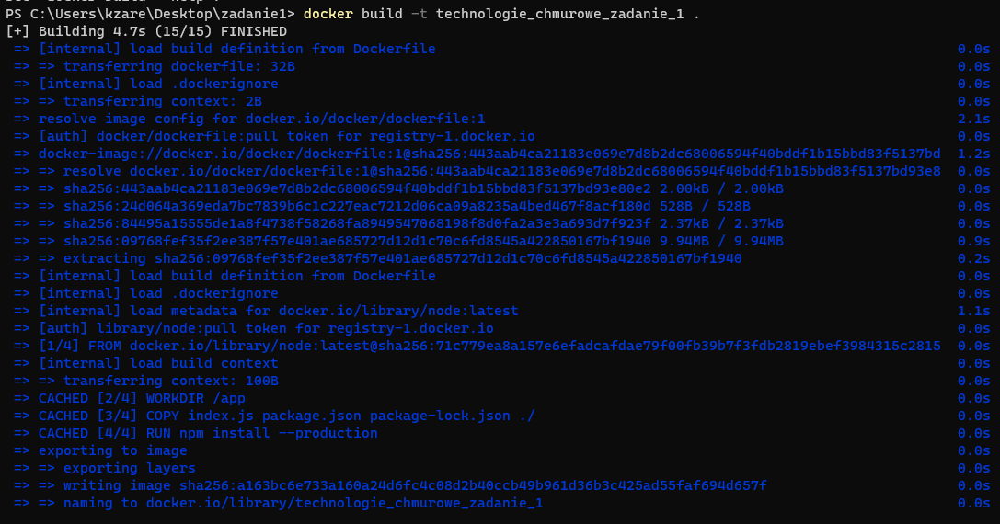
b. Utworzenie kontenera i podanie portu

```sh
docker create -p 8080:80 --name tc_zadanie1_kontener technologie_chmurowe_zadanie_1
```
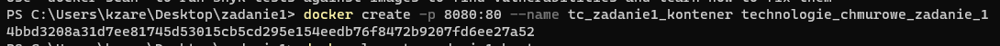

c. Trzeba użyć polecenia `docker logs` 

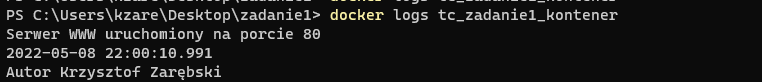

Jako alternatywa można skorzystać z desktopowej wersji aplikacji Docker i tam wyświetlić interesujące nas logi:

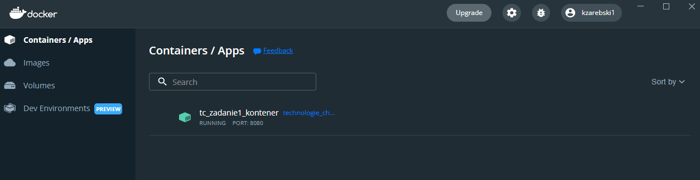

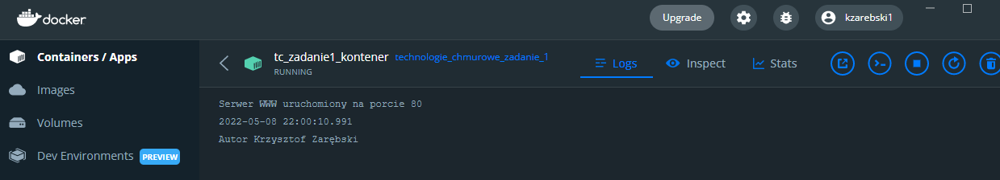

d. Należy użyć polecenia `docker history`:

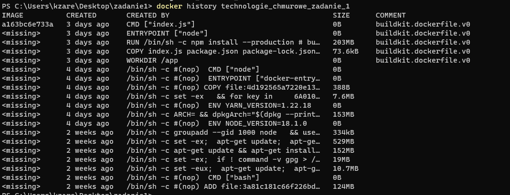

## 4. (Dodatek 1)
**Plik dodatek1.yml w katalogu .github/workflows/**

Budowa obrazów po publikacji branch master repo:
```sh
on:
  push:
    branches: [master]
```
Architektury wybiera się za pomocą parametru platforms:
```sh
platforms: linux/arm/v7, linux/arm64/v8, linux/amd64

```
Do zbudowania obrazu należy spushować branch na repozytorium poprzez polecenie:
```sh
git push --force github HEAD:master
```
Push na GitHub Actions:
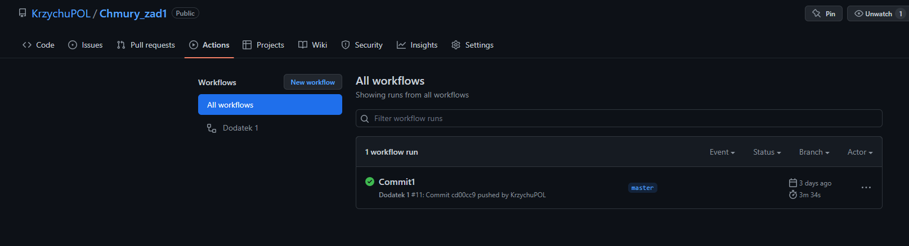
## GitHub Container Registry
Do opublikowania image na GitHub Container Registry należy podać adres rejestru do logowania oraz prefiks do nazwy tagu w kroku budowania. By nie duplikować adresu repozytorium oraz nazwy tagu, zapisać je trzeba w zmiennych środowiskowych.
```sh
env:
registry: ghcr.io
IMAGE_NAME: technologie_chmurowe_zadanie_1:latest

```
Należy wykorzystać te zmienne jako parametry do logowania do repozytorium oraz budowania i publikacji. Do parametru tags trzeba podać 2 tagi. 1 odwołujący się do DockerHub i 2 do GitHub Container Registry.
```sh

      with:
          registry: ghcr.io
          username: ${{ github.actor }}
          password: ${{ secrets.TOKEN }}

          tags: |
            ghcr.io/${{ env.IMAGE_REPOSITORY }},${{ secrets.DOCKER_HUB_USERNAME }}/${{ env.IMAGE_NAME }}
```
## Cache
GitHub Actions do przechowywania cache: Należy ustawić parametry cache-from i cache-to na wartość **gha** co oznacza integrację Dockera z GitHub Actions.
```sh
          cache-from: type=gha
          cache-to: type=gha
```
Do sprawdzenia działania cache trzeba skorzystać z polecenia:
```sh
OWNER='KrzychuPOL' REPO='Chmury_zad1' sh -c 'curl "https://api.github.com/repos/${OWNER}/${REPO}/actions/cache/usage"'
```
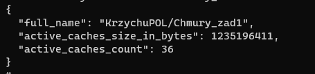

## Dodatek 2
## 1 a)
Należy pobrać obraz rejestru:
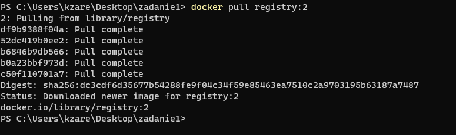
Utworzenie kontenera. Listning ustawiony na port 5000, przekierujemy komunikację z portu 6677 na port 5000 z użyciem parametru -p

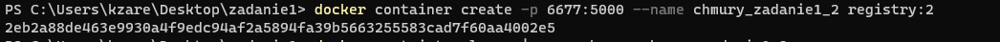
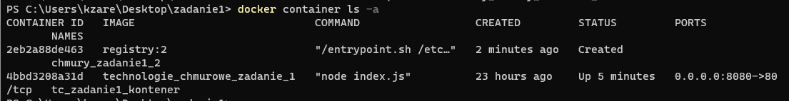

Uruchomienie kontenera:

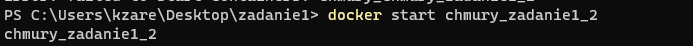

Serwer rejestru działa.
### 1 b)
Pobranie obrazu ubuntu:

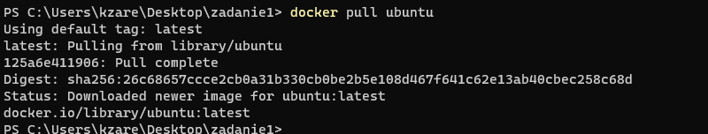

Zmiana nazwy, zapis w rejestrze:

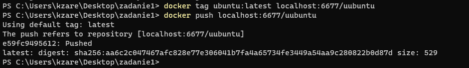

## 2.
Do włączenia mechanizmu basic auth potrzeba włączyć TLS. Należy skorzystać z protokołu HTTPS i certyfikatu. Wygenerowałem cały certyfikat i dodałem go do magazynu systemu operacyjnego.

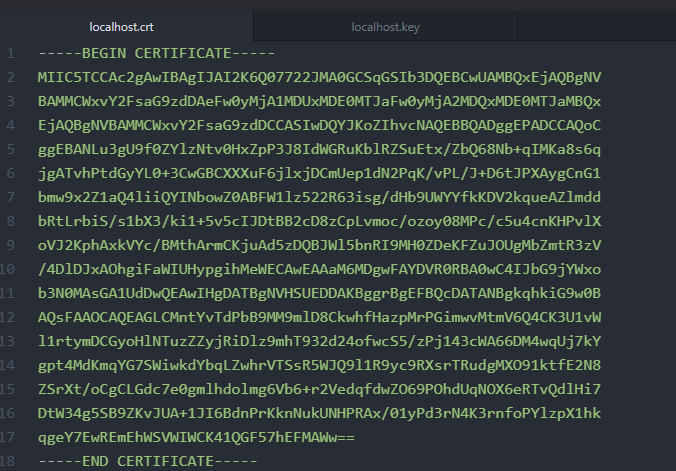
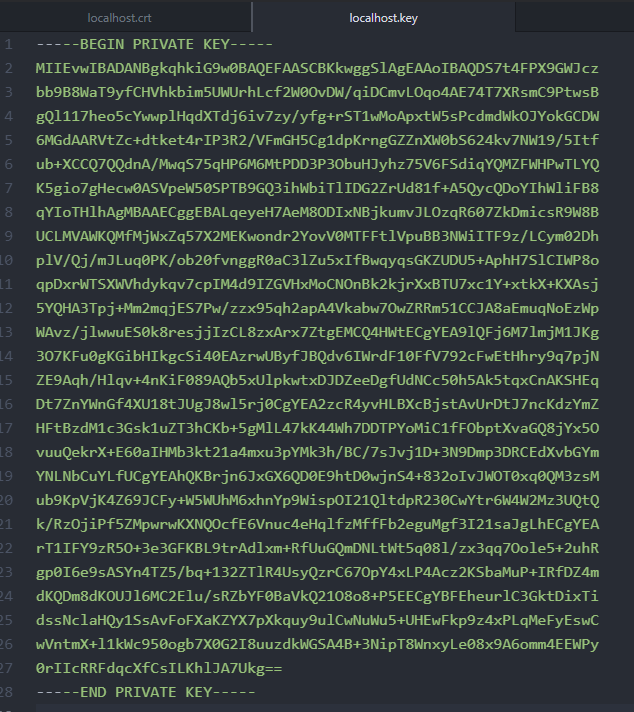

Dodanie certyfikatu do systemu:

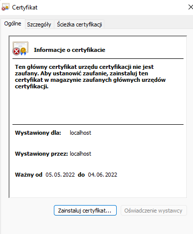
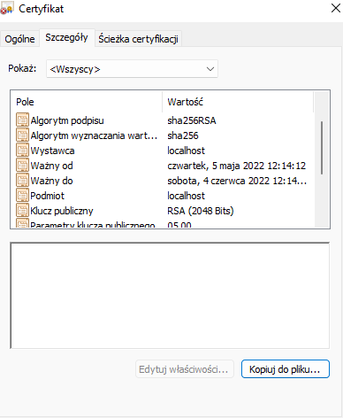

Należy zawsze ufać certyfikatowi.

Generowanie hasha hasła dla użytkownika w pliku htpasswd

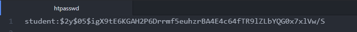

Ponowne utworzenie kontenera z nową konfiguracją i plikiem httpasswd z użyciem bind-mount

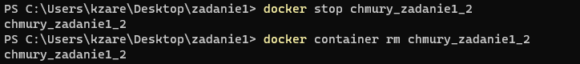
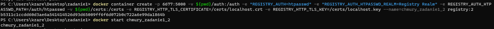

Działanie basic auth:

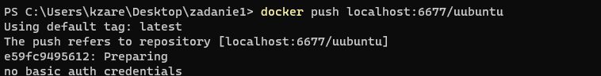
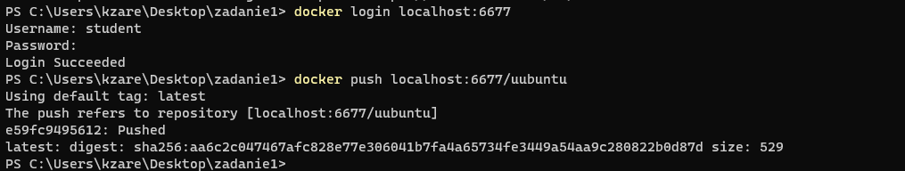
